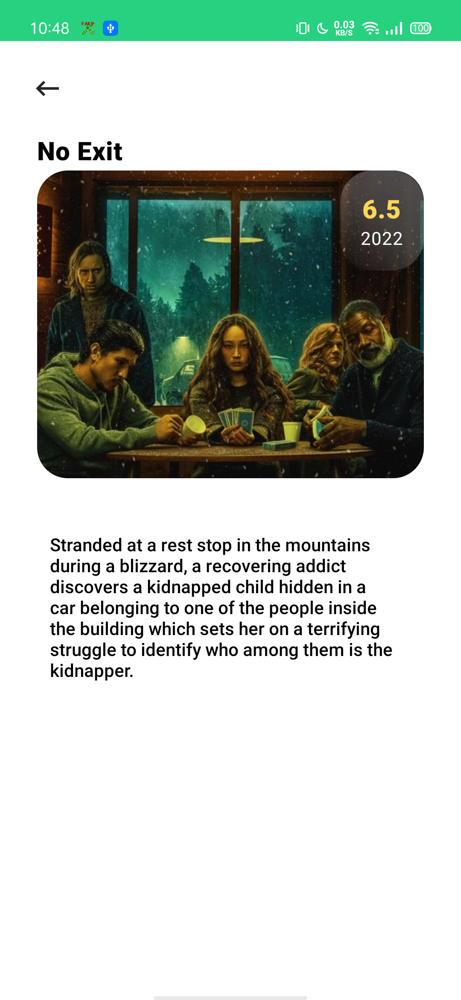

A            |  A
:-------------------------:|:-------------------------:
  |  

#### Overview
-------------

Our intern created a demo application that fetches a list of movies from an API, shows it and on
click opens a detail screen for the given movie. Since he just started Android development the
project does not follow the Android Best Practices or Material Guidelines.

It is up to you to bring the project and / or UI to a more senior level.

#### Requirements
-------------

1. Make the App runnable, List screen and detail screen should work.
2. Setup Dependency Injection
3. Migrate the network call from RxJava to Kotlin Coroutines
4. Enhance the Movie List and detail screen by adding images
5. Add Unit & UI Tests
6. Fix code smells/bad usages that you see

PS: Feedback on the challenge is greatly appreciated, what did you like / don't like?

- refactoring is a very nice idea.

### Features
-------------

* [Kotlin Coroutines]()
* [Flow]()
* [Hiding secretKeys in properties Files using gradle secrets](https://github.com/google/secrets-gradle-plugin)
* [Dependencies Versions & update plugin](https://jmfayard.github.io/refreshVersions/)
* [Dagger-Hilt](https://dagger.dev/hilt/gradle-setup)
* [Use Cases Approach](https://proandroiddev.com/why-you-need-use-cases-interactors-142e8a6fe576)
* [Dependency inversion](https://medium.com/@kedren.villena/simplifying-dependency-inversion-principle-dip-59228122649a)
  and [SOLID](https://medium.com/backticks-tildes/the-s-o-l-i-d-principles-in-pictures-b34ce2f1e898)
* [Unit Testing]() using [mockK](https://mockk.io/), [Kotest](https://github.com/kotest/kotest)
  , [turbine](https://github.com/cashapp/turbine)
* [Ui Testing]() using [Kaspresso](https://github.com/KasperskyLab/Kaspresso)

### Enhancements
-------------

* Used functions rather than using interfaces
* Used data binding in adapter
* Moved repeated functions to ktx

### Future implementations
-------------

* Add network call to `MoviesDetails`
* Make the list Pagination work with the api using `Paging` library.
* Integrate `Room` with  `RemoteMediator` with `LocalDataSource`.
* Make the `repository` fetch the data first -> cache it -> read from cache. 

---

I didn't add pagination this time for lack of time for it, there was other things that were more important at the moment like the architecture and di.


###### to add new `Dependencies` you have two methods :

- do it like this [Video](https://youtu.be/VhYERonB8co)
- or add the dependency in `buildSrc/Libs` like this
  ```const val security_crypto: String = "androidx.security:security-crypto:_"```
- then add it in `build.gradle.kts` of the app like this
  ```implementation(Libs.State.appState)```

###### to get latest `Dependencies` versions run this gradle command :

```
./gradlew refreshVersions
```

##### latest versions will be in [versions.properties]() to select from.

###### `TO ADD NEW SECRETS ` put them in `secrets.properties` file that is located in `ROOT` project folder

``` json
token_header_name="Authorization"
base_url="https://api.github.com/"
```

### [Structure is Based on my own structure here](https://github.com/EsmaeelNabil/refresh-starter-template/tree/hilt)


